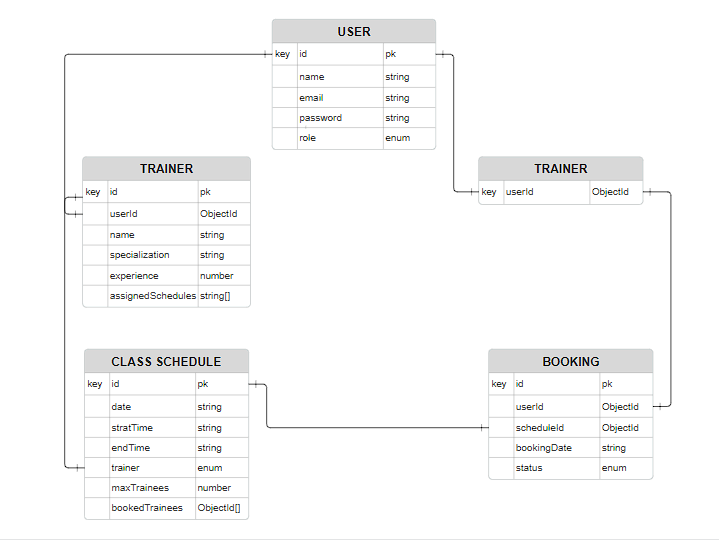

# Gym Class Scheduling and Membership Management System

## Project Overview

This system is designed to manage gym operations efficiently. It allows for class scheduling, trainer management, and trainee bookings. The system defines three roles: Admin, Trainer, and Trainee, each with specific permissions.

## Relation Diagram



## Technology Stack

- Backend: Node.js with Express.js
- Language: TypeScript
- Database: MongoDB
- ORM: Mongoose
- Authentication: JSON Web Tokens (JWT)
- Validation: Zod

## API Endpoints

### Authentication

- POST /api/auth/register - Register a new user (trainer or trainee)
- POST /api/auth/login - User login

### Trainers

- GET /api/trainer/all - Get all trainers
- GET /api/trainer/:id - Get a specific trainer
- POST /api/trainer - Create a new trainer (Admin only)
- PUT /api/trainer/:id - Update a trainer (Admin only)
- DELETE /api/trainer/:id - Delete a trainer (Admin only)

### Trainee

- GET /api/trainee/profile - Get the logged-in trainee's profile
- PATCH /api/trainee/update-profile - Update the logged-in trainee's profile

### Class Schedules

- GET /api/schedule/all - Get all schedules (Admin and Trainer only)
- GET /api/schedule/:id - Get a specific schedule (Admin only)
- POST /api/schedule - Create a new schedule (Admin only)
- PUT /api/schedule/:id - Update a schedule (Admin only)
- DELETE /api/schedules/:id - Delete a schedule (Admin only)

### Bookings

- GET /api/booking/trainee - Get all bookings for the logged-in trainee
- POST /api/booking - Create a new booking (Trainee only)
- DELETE /api/booking/cancel/:id - Cancel a booking (Trainee only)

## Database Schema

### User Model

```typescript
{
  name: string;
  email: string;
  password: string;
  role: "admin" | "trainer" | "trainee";
}
```

### Trainer Model

```typescript
{
  userId: Types.ObjectId;
  name: string;
  specialization: string;
  experience: number;
}
```

### Schedule Model

```typescript
{
  trainer: Types.ObjectId;
  date: Date;
  startTime: string;
  endTime: string;
  capacity: number;
  bookedTrainees: Types.ObjectId[];
}
```

### Booking Model

```typescript
{
  traineeId: Types.ObjectId;
  scheduleId: Types.ObjectId;
  status: "confirmed" | "cancelled";
}
```

## Admin Credentials

- Email: admin@gmail.com
- Password: admin123

## Trainer Credentials

- Email: trainer@gmail.com
- Password: trainer123

## Trainee Credentials

- Email: trainee1@gmail.com
- Password: trainee123

Trainee's email will increase by one repectively for further check while password will be same..

## Instructions to Run Locally

1. Clone the repository:

   ```
   git clone https://github.com/labibahmed10/gym-management-be.git
   cd gym-management-be
   ```

2. Install dependencies:

   ```
   npm install
   ```

3. Set up environment variables:
   Create a `.env` file in the root directory and add the following:

   ```
   NODE_ENV=development
   PORT=5000
   DATABASE_URL=your_mongodb_connection_string
   BCRYPT_SALT_ROUND=number
   JWT_ACCESS_SECRET=your_jwt_access_secret
   ACCESS_TOKEN_EXPIRES_IN=your_access_token_expires_in
   ```

4. Run the development server:

   ```
   npm run dev
   ```

5. The server should now be running on `http://localhost:5000`

## Live Hosting Link

[https://gym-management-be-xi.vercel.app](https://gym-management-be-xi.vercel.app)

## Testing Instructions

### Admin Login Credentials

Use these credentials to log in as an admin:

- Email: admin@gmail.com
- Password: admin123

### Testing Key Features

#### 1. Admin: Creating Trainers

1. Log in as an admin using the credentials provided above.
2. Send a POST request to `/api/trainer` with the following body:
   ```json
   {
     "userId": "<user_id>",
     "name": "John Doe",
     "specialization": "Yoga",
     "experience": 5
   }
   ```
3. You should receive a 201 status code with the created trainer details.

#### 2. Admin: Scheduling Classes

1. Ensure you're logged in as an admin.
2. Send a POST request to `/api/schedules` with the following body:
   ```json
   {
     "trainer": "<trainer_id>",
     "date": "2023-06-01",
     "startTime": "10:00",
     "endTime": "12:00"
   }
   ```
   Replace `<trainer_id>` with an actual trainer ID from your database.
3. You should receive a 201 status code with the created schedule details.

#### 3. Trainee: Booking a Class

1. Register a new trainee account or use an existing one.
2. Log in as the trainee.
3. Send a POST request to `/api/bookings` with the following body:
   ```json
   {
     "scheduleId": "<schedule_id>",
     "traineeId": "<trainee_id>",
     "bookingDate": "date"
   }
   ```
   Replace `<schedule_id>` with an actual schedule ID from your database.
4. You should receive a 201 status code with the booking details.

#### 4. Trainee: Cancelling a Booking

1. Ensure you're logged in as a trainee with an existing booking.
2. Send a DELETE request to `/api/booking/cancel/<booking_id>`.
3. You should receive a 200 status code with the updated booking status.

#### 5. Trainer: Viewing Assigned Schedules

1. Log in as a trainer.
2. Send a GET request to `/api/schedule/all`.
3. You should receive a 200 status code with a list of schedules assigned to the trainer.

#### 6. Trainee: Viewing All Bookings for a Schedule

1. Log in as a trainee.
2. Send a GET request to `/api/booking/trainee`.
3. You should receive a 200 status code with a list of all bookings for the specified schedule.

### Notes for Testing

- Replace placeholder IDs (like `<trainer_id>`, `<schedule_id>`, `<booking_id>`) with actual IDs from your database.
- Ensure you're using the correct authentication token for each request. The token should be included in the Authorization header as a Bearer token.
- Pay attention to the response status codes and error messages for proper error handling.
- Test edge cases, such as:
  - Trying to book a full class
  - Attempting to create more than 5 schedules per day
  - Booking conflicting time slots
  - Accessing routes without proper authorization

For a more comprehensive testing experience, consider using API testing tools like Postman or Insomnia. These tools allow you to save and organize your API requests, making it easier to test your application thoroughly.
